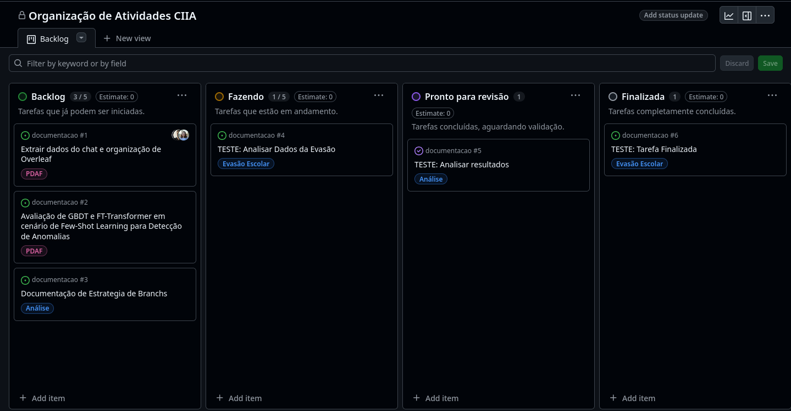

# 🛠️ Processo de Desenvolvimento

### Introdução

O processo de desenvolvimento proposto busca garantir organização, transparência e eficiência na realização das atividades. Para isso, adotar ferramentas e métodos que permitem acompanhar o andamento das tarefas, definir prioridades e colaborar de forma coordenada.

Esta página apresenta como estruturamos o fluxo de trabalho do projeto, explicando a ferramenta utilizada, o modelo de organização adotado e como as tarefas são distribuídas e monitoradas.

---

### Ferramenta utilizada: GitHub Projects

Utilizar o **GitHub Projects**, uma ferramenta integrada à plataforma GitHub que permite criar quadros de organização de tarefas (semelhante ao Trello ou Jira). Com ela, é possível visualizar as tarefas em diferentes etapas do desenvolvimento e atribuir responsabilidades de forma clara.

---

### Método de organização: Kanban

Adotar o modelo **Kanban**, que organiza as tarefas em colunas que representam o estado atual de cada atividade. Esse modelo facilita a visualização do progresso e ajuda a identificar gargalos ou tarefas paradas. A movimentação das tarefas entre as colunas representa o avanço do trabalho.

---

### Estrutura do Quadro

O quadro de tarefas está estruturado com as seguintes diretrizes:

1. **Etapas do fluxo de trabalho**

   * **Backlog**: tarefas que já podem ser iniciadas.
   * **Fazendo**: tarefas que estão em andamento.
   * **Pronto para revisão**: tarefas concluídas, aguardando validação.
   * **Finalizada**: tarefas completamente concluídas.

2. **Categorias por tema**

   * As tarefas são identificadas com *tags* (etiquetas) que indicam o tema principal:

     * **PDAF** (Programa de Descentralização Administrativa e Financeira)
     * **Evasão Escolar**
   * Essas tags facilitam a filtragem e o acompanhamento de tarefas específicas por tema.

3. **Responsabilidade e colaboração**

   * Cada membro da equipe deve se **ligar (atribuir-se)** às tarefas em que estiver envolvido.
   * Isso ajuda na organização do trabalho, na definição de responsáveis e no acompanhamento do progresso.

